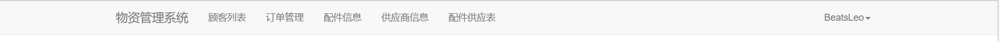

# 交互式社会心理分析系统(ISPS)开发安排

**每周日晚上八点召开小组会议，每个人汇报自己的工作进度，交流学习内容。**


**目标：**

基本完成整个开放域事件抽取项目前后端的开发。


**时间：**

1月9日 — 2月18日，共大约5周时间，中间春节进度可以适当减缓一个周。


## 数据和算法部分

### 李帅

主要任务：完成事件抽取和情感分析

> * [x] NLP项目相关知识学习（预计2周）
>
>   * [x] NLP基础传统模型，语言模型
>
>   * [x] 触发词抽取
>
>   * [x] huggingface中所需模型的使用
>
> * [ ] 开放域事件抽取（预计1周）
>
>   * [x] 数据集的构建（中短句、长篇，为什么？（统计tag））
>
>     * [x] `doccano`标注
>     * [x] ```json
>       //域名: http://www.beatsleo.com:8000/
>                 
>       // 管理员账号
>       '用户名': isps
>       '密码': isps
>                 
>       // 个人账号
>       '用户名': 姓名
>       '密码': isps1234
>       ```
>     * [x] `[时间, 地点, 触发词, 人物, 物品, 动作, 事物, 机构, 数量, 单位, 原因, None]`
>
>       `妈妈叫我去厨房拿勺子`、`今天看了一场演唱会`、`我买了5公斤重的苹果`、`一帮大学生因疫情防控不当上街游行`、`他的儿子把他送进了医院`
>
>   * [x] 模型搭建、训练、测试
>
>     * [x] 文本摘要
>       * [x] Rouge评价指标
>
>       * [ ] 利用ChatGPT生成数据时的prompt：
>
>         ```python
>         s = '校园路演北京外国语大学场一位二刷的观众问参宿醒来想到南河，会不会有巨大的心理负担，导演是这样解释的电影的结局是开放式的，她会背负着南河的一生继续生活，还是留在自己的梦境？但千百次梦醒也许她会明白为什么而活着，或许会选择努力做另外一位南河，成为别人的光。'
>                                 
>         message = """
>         请按照以下格式生成10-15字的摘要，且保证文本原意不变：
>         文本：机场航站楼门口偶遇鞠婧祎鞠婧祎这腰比我腿都细本人真的好美！！
>         摘要：机场偶遇鞠婧祎
>         文本：{}
>         摘要：
>         '""".format(s)
>         ```
>       
>     * [x] 命名体识别
>     
>       * [ ] 单独的一句感叹句（今天真无聊！），没有包含任何事件信息，对社会心态的反映不起任何作用，没有意义，事件抽取时将其过滤。
>     
>       * [ ] 利用ChatGPT生成数据时的prompt：
>     
>         ```python
>         sentence = '鼓励大家积极分享彼此的喜悦和兴奋，倾听他人的故事和经历，营造一个积极向上的氛围。'
>                           
>         message = """
>         请从【时间、地点、触发词、人物、物品、动作、事物、机构、数量、单位、原因、None】这些命名体中选择相应的命名体，且保证每个字都有其对应的命名体，其中未识别出实体的字对应标签None，形容词对应的标签为None。一个句子里面尽量会有一个触发词，示例如下：
>         句子：
>         机场偶遇了鞠婧祎。
>         命名体：
>         机场：地点
>         偶遇：触发词
>         了：None
>         鞠婧祎：人物
>         现在，根据上面示例，对下面句子进行命名体识别，其中标签只能为【时间、地点、触发词、人物、物品、动作、事物、机构、数量、单位、原因、None】中的一个，无法识别的则为标签None，一个句子里面尽量有一个触发词，注意保证所有的字都有其对应的命名体标签：
>         句子：
>         {}
>         命名体：
>         """.formath(sentence)
>         ```
>   
>     * [ ] 模型训练与爬虫所得数据的直接耦合
>   
>
> * [ ] 情感分析（预计1周）
>
>   * [x] 数据集的构建
>   * [x] 数据PADDING的设计
>
>   * [x] 模型搭建、训练、测试
>   * [ ] 模型与事件抽取所得数据及爬虫原始数据的直接耦合
>
> * [ ] 将模型结合并使用（预计1周）
>
>   * [x] 在预测过程中统计位置、时间信息，并存入数据库
>   * [x] 关键词频率统计，以供词云展示
>
> * [ ] 人机交互部分与指导建议生成模型（预计开学后1-2周）
>
>   * [ ] 外网找建议生成模型的数据
>
>     * [ ] 使用ChatGPT时的prompt：
>
>       ```python
>       event = '去马尔代夫看世界'
>       attitude = '厌烦'
>       message = """
>       请针对事件及其引起的心态变化，分点给出80-100字的引导建议。示例如下：
>       事件：机场偶遇鞠婧祎。
>       心态：高兴。
>       引导建议：
>       1.鼓励积极分享：鼓励大家积极分享彼此的喜悦和兴奋，倾听他人的故事和经历，营造一个积极向上的氛围。
>       2.强调尊重和礼貌：提醒大家要尊重偶像和其他旅客的隐私和个人空间，避免对他们造成不必要的困扰和不安全因素。
>       3.提倡感恩和珍惜：引导大家感恩这个难得的机会，并提倡珍惜这个美好的时刻，用心记录和回忆这个经历。
>       4.引导理性思考：提醒大家要保持冷静和理智，避免过度热衷或表现过度，理性思考自己的行为举止是否适当。
>       现在，请按照上述格式针对下面事件及其引起的心态变化补全引导建议，且字数在80-100字左右。
>       事件：{}。
>       心态：{}。
>       引导建议：
>       """.format(event, attitude)
>       ```
>
>   * [ ] ChatGPT + GPT2(With prompt) + 判别模型
>
>     * [ ] GPT2的prompt：
>
>       ```python
>       event = '机场偶遇鞠婧祎'
>       attitude = '高兴'
>       message = """
>       对于“{}”这件事，大家都表现出“{}”的心态。对于此心态的出现，引导建议为：
>       """.format(event, attitude)
>       ```
>


### 刘天一

主要任务：完成微博、抖音和Bilibili平台的爬虫

> * [ ] Scrapy框架与Selenium库的学习（预计1周）
>
>   * [x] Scrapy的基本使用
>   * [ ] Selenium的基本使用
>   * [x] 边学边写，能以本项目要爬的平台为案例最好
>
> * [ ] 微博平台的爬取与数据清洗（预计1周）
>
>   * [x] 以dict的形式存储数据
>
>     ```python
>     data = {
>         'event': None, # 该条帖子的核心事件，以 #xxx# 的tag格式引出，若有多条，随机选择一条或选择第一条，若没有则为None
>         'post': 'xxx',	# 帖子的内容
>         'time': 'xxxx-xx-xx',	# 发布时间，以给出格式存储
>         'ip': 'xxx',	# 帖子发布者的IP位置信息
>     	'thumbs': int,	# 点赞数
>
>         'comments': [{	# 评论，以嵌套dict的形式存储
>             'content': 'xxx'	# 评论内容
>             'time': 'xxxx-xx-xx',	# 评论时间，以给出格式存储
>             'ip': 'xxx',	# 评论发布者的IP位置信息
>             'thumbs': int	# 点赞数
>         }, ..., ]
>     }
>     ```
>
>   * [x] 从微博的热门、社会、科技、电影、音乐、数码、汽车、游戏里面爬取数据，只爬点赞数量超过100或评论数量超过20的。
>
>   * [x] 将所有图片过滤掉，只保留文字。
>
>   * [ ] 尽可能爬取多的帖子和评论，对反爬手段采取合适的措施
>
>   * [x] 暂存本地
>
> * [ ] 抖音平台的爬取与数据清洗（预计1周）
>
>   * [ ] 以dict的形式存储数据
>
>     `data数据格式同上，其中'event'的tag格式为 #xxx ，在部分视频中会有xx榜或xx热点的提示，如果存在优先选择提示中的内容作为event(class="wKeF4l1I")，帖子内容为视频标题`
>
>   * [ ] 从抖音的热点、游戏、娱乐、二次元、音乐、美食、知识、体育、时尚里面爬取数据，只爬点赞数量超过100或评论数量超过20的。
>
>   * [ ] 将所有图片过滤掉，只保留文字。
>
>   * [ ] 暂存本地
>
> * [x] Bilibili平台的爬取与数据清洗（预计1周）
>
>   * [x] 以dict的形式存储数据
>   
>* [ ] 连接数据库，设置定时器，实现对三个平台的定时并行爬取（预计1周）
> 
>  * [ ] 并行爬取的实现
>   * [ ] 大概每1或2小时爬一次
>   * [ ] 将保存部分从本地改为存储在服务器数据库中，具体格式见周云弈部分。


## 服务器和网站部分

### 周芳妍

主要任务：网站排版、图片和主题色调的设计

>* [x] 拟定主题色调
>
>   * [x] 
>
>   * [ ] 补充
>
>   * [x] 登录界面设计
>
>   * [x] 背景图片
>   * [x] 内容、元素排版
>
>* [ ] 网站首页设计（预计1周）
>
>   * [ ] 项目介绍文案（先空出来或随便给点无关的话占着位置）
>
>   * [x] 导航栏（首页、热点事件、社会心态分析、心态调整建议库），含登录头像，类似于下图（放在整个网站所有网页的顶部）：
>
>
>      
>
>   * [x] 搜索框
>
>   * [x] 部分热点事件展示
>
>   * [x] 中国心态热力分布图（随时间变化）
>
>   * [x] 高频词云图
>
>   * [x] 心态变化时间图（饼图或柱状图）
>
>   * [x] 热点地区变化时间图
>
>* [x] 热点事件页面设计（预计1周）
>
>   * [x] 热点事件列表（支持点击展开、筛选）
>       * [x] 点击某一事件时，会有事件对应的心态分布图（热力地图、饼图或柱状图），评论词云
>       * [x] 事件支持筛选：按地区、时间
>
>   * [x] 热点事件关键词云
>   * [x] 热点地区热力图（同首页）
>
>* [x] 心态分析页面设计（预计1周）
>
>   * [x] 各心态列表
>      * [x] 可点击（同热点事件）
>          * [x] 点击某一心态时，可以看到心态背后的事件导向，引导建议，评论词云
>          * [x] 事件支持筛选：按地区、时间
>
>   * [x] 心态占比饼图
>
>* [x] 中国心态热力分布图（同首页）
>
>   * [x] 需要人工校正的列表
>       * [x] 评论原句，后面下拉框，可选择心态
>
>* [x] 心态调整建议库（预计1周）
>
>   * [x] 针对十三种心态均设置进入窗口
>       * [x] 点击进入建议生成，输入事件 + 心态，输出建议
>
>


### 周云弈 

主要任务：学习Django，腾讯云服务器的使用，网站后端搭建

> * [x] 学习后端技术（预计1周）
>   * [x] 对Django基本操作的熟悉使用
>   * [x] 学习使用pyecharts
>
> * [ ] 项目平台的云服务器配置与后端登录界面（预计1周）
>   * [x] 腾讯云服务器的使用流程
>
>     * [x] 服务器密码：`#BeatsLeo110`
>
>     * [x] 服务器数据库信息
>
>       ```python
>       DATABASES = {
>           'default': {
>               'ENGINE': 'django.db.backends.mysql',
>               'NAME': 'isps',				# 使用的database名
>               'USER': 'root',				# 数据库用户名
>               'PASSWORD': 'lishuai110',	# 数据库密码
>               'HOST': '139.155.236.234',	# 服务器地址
>               'PORT': '3306',				# 数据库端口号
>           }
>       }
>       ```
>
>   * [x] 数据库的搭建
>     * [x] 评论表：<u>comments_id</u>(自动增长INT), event_id(INT), content(CHAR(255)), time(DATE), province(Smallint)[0-34], thumbs(INT), attitude(Smallint)[0-12]
>
>     * [x] 事件表：<u>event_id</u>(自动增长INT), event(CHAR(255)), post(CHAR(512)), time(DATE), province(Smallint)[0-34], thumbs(INT)
>
>     * [x] 模型训练表：<u>train_id</u>(自动增长INT), comments_id(INT), label(Smallint)[0-12], correct(Smallint)[0-12]
>
>     * [x] 待校正表：<u>id</u>(自动增长INT), comments_id(INT), label(Smallint)[0-12]
>
>     * [ ] 爬虫信息表：<u>id</u>(自动增长INT), time(DATE), add(INT), positive(INT), neutral(INT), negative(INT)
>
>       ---
>
>     * [x] 评论统计表：<u>comments_id</u>(自动增长INT), comment_time(DATE), content(CHAR(255)), province(Smallint)[0-34], attitude(Smallint)[0-12], thumbs(INT), event_id(INT)
>
>     * [x] 事件统计表：<u>event_id</u>(自动增长INT), post(CHAR(512)), summary(CHAR(255)), total_attitude(Smallint)[0-12], events(CHAR(32)), institution(CHAR(32)), moves(CHAR(32)), numbers(CHAR(32)), people(CHAR(32)), place(CHAR(32)), reason(CHAR(32)), things(CHAR(32)), time(CHAR(32)), trigger(CHAR(32)), unit(CHAR(32))
>
>     * [x] 事件分布表：<u>id</u>(自动增长INT), event_time(DATE), province(Smallint)[0-34], hot(INT), event_id(INT)
>
>     * [x] 评论关键词表：<u>id</u>(自动增长INT), time(DATE), word(CHAR(32)), numbers(INT64), attitude(Smallint)[0-12], event_id(INT)
>
>     * [x] 事件关键词表：<u>id</u>(自动增长INT), time(DATE), word(CHAR(32)), numbers(INT64)
>     
>   * [ ] 项目网站的登录、验证设置
>   
> * [x] 项目网站的其它跳转与页面命名（预计2周）
>
>   ```python
>   # 需要在运行时生成的全局变量，内容为首页所需数据，以便前端直接获取，减少运算
>   INDEX_INFO = {
>       'attitude':	{'xxxx-xx-xx': [[], ..., []]}	# 键为日期，值为二维数组，行为省，列为心态数量(下标与数据库中的键所对应), 
>       'event': {'xxxx-xx-xx': []}		# 键为日期，值为一维数组，下标为省，对应值为该省事件热度(下标与数据库中的键所对应), 
>       'words': {'xxx': 20, ...}		# 键为关键词，值为关键词的频率，按照词云的容量存储前n个词频对就行
>       'event_ids': {'xxx': 1324},		# 键为事件，值为事件的热度，按近一周的热度和取前n个就行
>   }
>   ```
>
>   * [x] 参照周芳妍部分给每个需要的网页设置跳转
>   * [x] 为前端所需要的数据编写数据读写函数，为前端生成统计图表
>   * [x] 与刘熠杨交流，调整结合前端模板，在Django上进行前后端共同调试
>   * [ ] 将李帅部分的模型加入，共同测试功能
>
> * [ ] 所有功能整合（预计1周）
>   * [x] 以Ajax形式定时更新需要数据库内容，更新上述全局变量
>     * [x] 热度计算公式：$2 \times comments + com\_thumbs + event\_thumbs$
>   * [ ] 待补充


### 刘熠杨

主要任务：学习Django，Vue和bootstrap，网站前端搭建

> * [x] 学习前端技术（预计1周）
>   * [x] 学习Django的前端模板
>   * [x] 学习bootstrap框架（CSS） 、Vue框架（JS）
>
> * [x] 根据周芳妍给出设计完成登录界面和首页的前端代码（预计2周）
>   * [x] 与周云弈协商，告诉后端需要什么数据
>   * [x] 按给出风格和排版做好前端页面代码编写
>   * [ ] 不推荐px, 推荐rem
>
> * [ ] 根据周芳妍给出设计完成热点事件的前端代码（预计1周）
>   * [x] 要求同上，并参照周芳妍部分
>
> * [ ] 根据周芳妍给出设计完成心态分析的前端代码（预计1周）
>   * [x] 要求同上，并参照周芳妍部分
>
> * [ ] 根据周芳妍给出设计完成心态调整建议库的前端代码（预计1周）
>   * [x] 要求同上，并参照周芳妍部分
>
>     
>
> * [ ] 页面title名字更改


### 部分参数约定

后端构建省份与心态的键值对对应字典（全局）：

```python
# 省份表
PROVINCE = {
    '北京': 0,
    '天津': 1,
    '上海': 2,
    '重庆': 3,
    '河北': 4,
    '山西': 5,
    '辽宁': 6,
    '吉林': 7,
    '黑龙江': 8,
    '江苏': 9,
    '浙江': 10,
    '安徽': 11,
    '福建': 12,
    '江西': 13,
    '山东': 14,
    '河南': 15,
    '湖北': 16,
    '湖南': 17,
    '广东': 18,
    '海南': 19,
    '四川': 20,
    '贵州': 21,
    '云南': 22,
    '陕西': 23,
    '甘肃': 24,
    '青海': 25,
    '台湾': 26,
    '内蒙古': 27,
    '广西': 28,
    '西藏': 29,
    '宁夏': 30,
    '新疆': 31,
    '香港': 32,
    '澳门': 33,
    '其他': 34 
}

# 反过来访问
idx = 33
list(PROVINCE.keys())[idx]
<<< 澳门

# 心态表
ATTITUDE = {
    # 0-4: 积极
    '高兴': 0, 
    '搞笑': 1, 
    '期待': 2, 
    '肯定': 3, 
    '感动': 4, 
    # 5-9: 消极
    '悲伤': 5, 
    '愤怒': 6, 
    '厌恶': 7, 
    '担心': 8, 
    '无聊': 9, 
    # 10-12: 中性
    '警惕': 10, 
    '惊讶': 11, 
    '无所谓': 12, 
}

# 反过来访问
idx = 6
list(ATTITUDE.keys())[idx]
<<< 愤怒

# 颜色RGB转换表
COLOR = {'高兴': {'color': '#FFF2CC', 'rgb': (255, 242, 204)},
		 '搞笑': {'color': '#FFE699', 'rgb': (255, 230, 153)},
		 '钦佩': {'color': '#FFD966', 'rgb': (255, 217, 102)},
		 '肯定': {'color': '#FFBD0B', 'rgb': (255, 189, 11)},
		 '感动': {'color': '#F2B100', 'rgb': (242, 177, 0)},
		 '悲伤': {'color': '#CBD3EA', 'rgb': (203, 211, 234)},
		 '厌恶': {'color': '#9DACD5', 'rgb': (157, 172, 213)},
		 '愤怒': {'color': '#6379B5', 'rgb': (99, 121, 181)},
		 '担心': {'color': '#2B458F', 'rgb': (43, 69, 143)},
		 '无聊': {'color': '#021750', 'rgb': (2, 23, 80)},
		 '警惕': {'color': '#E2F0D9', 'rgb': (226, 240, 217)},
		 '惊讶': {'color': '#C5E0B4', 'rgb': (197, 224, 180)},
		 '无所谓': {'color': '#A9D18E', 'rgb': (169, 209, 142)}}


# 命名体识别表
NAME_TABLE = {
    'None': 0, 
    '时间': 1, 
    '地点': 2,
    '触发词': 3,
    '人物': 4,
    '物品': 5,
    '动作': 6,
    '事物': 7,
    '机构': 8,
    '数量': 9,
    '单位': 10,
    '原因': 11,
    '开/尾': 12,
}


```