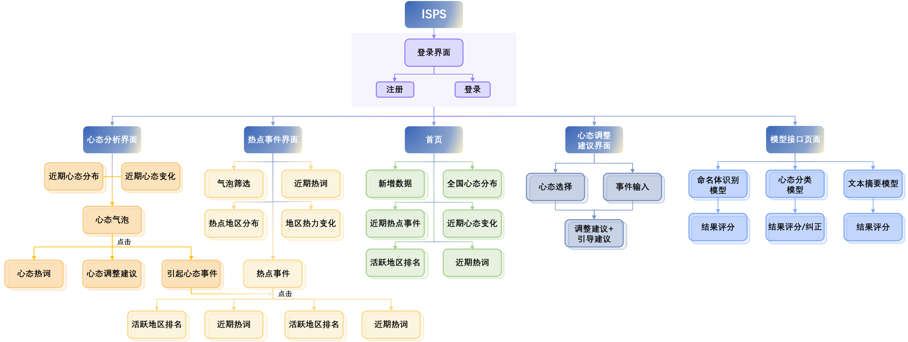
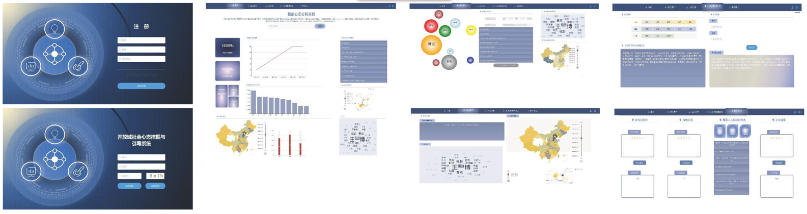

# 交互式社会心理分析系统(ISPS)

2023年四川大学大创项目—基于开放域事件提取的社会心态交互式挖掘与引导系统

### 项目简介

​		随着互联网的社会问题和矛盾不断积累，消极社会心态的及时挖掘和引导愈发重要。为此，本项目基于人在环路、开放域事件抽取与社会心态分析的技术框架，构建基于开放域事件提取的社会心态交互式挖掘与引导系统，交互式挖掘社会心态的演化机制，摸清其背后的事件原因，并提供社会心态引导建议，形成针对社会心态的智能监控、分析、归因和引导的一体化解决方案，辅助社会治理。

​		本项目所使用的深度学习模型[[1]](###参考文献)基于Pytorch框架开发，网站前端使用Vue框架，后端使用Django框架。

##### 功能介绍

​		本项目通过爬取微博、BiliBili等主流网络平台得到互联网的动态信息，并从该信息中**监控**所含事件，**分析**互联网用户的心态变化，并**归因**到对应事件中。此外，针对不同事件所造成的心态影响，本项目也会为其定制地进行合理地心态**引导**。具体技术流程见[技术讲解]。

### 网站向导

​		本项目网站主要分为如下5个界面。其中，可以在心态分析界面看到近期全国心态变化，并可通过点击浏览引起变化的背后事件导向；在热点事件界面看到近期热点事件以及活跃地区；在心态调整建议界面获取心态调整建议；在模型接口界面使用我们的模型，并给予反馈以供模型的修正。

​		项目网址为：http://www.beatsleo.com

### 技术细节

​		我们将爬取到的数据分为用户动态和网友评论两部分。对于用户动态，我们使用Bart模型进行文本摘要，找出核心事件，并训练DeBERTa模型识别关键命名实体，将重合度高的事件进行聚类合并。在获得核心事件后，我们训练RoBERTa模型对核心事件及其下的评论进行心态分析，并将其归因于对于事件。除此之外，我们利用GPT2训练了引导建议的生成模型，针对不同事件对其所造成的心态影响进行合理引导。这里训练所使用的预训练模型均源自于IDEA-CCNL的[封神榜语言模型[1]](https://github.com/IDEA-CCNL/Fengshenbang-LM)。

### 开发人员

### 参考文献

[1] IDEA-CCNL: Fengshenbang-lm. https://github.com/IDEA-CCNL/Fengshenbang-LM (2021)